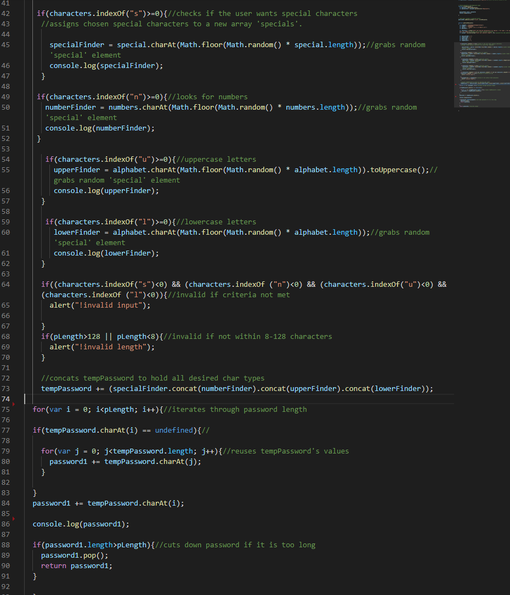
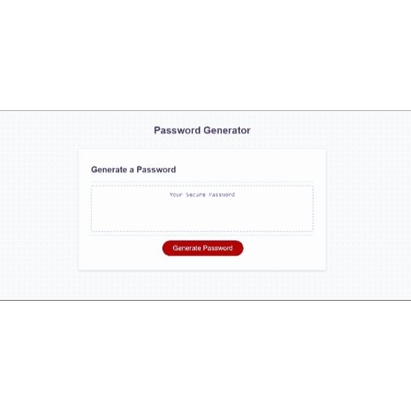

# Nuclear-Password

This program is made for the sole purpose of designing a simple, yet secure password of your choosing. The program produces a password with a length of at least 8 characters, with no more than 126 characters. It may contain lower/upper case letter(s(), number(s), or special keyboard character(s). 

### Installing

In order to recreate this work, the following software may be downloaded. 
- [VS Code](https://code.visualstudio.com/download)
- [git](https://git-scm.com/downloads)

After downloading and initializing these things, run and intialize their settings to match your machine requirements.

## Built With

* [HTML](https://developer.mozilla.org/en-US/docs/Web/HTML)
* [CSS](https://developer.mozilla.org/en-US/docs/Web/CSS)
* [Javascript](https://developer.mozilla.org/en-US/docs/Web/JavaScript)

## Deployed Link

* [See Live Site](https://mt722.github.io/Nuclear-password/)
* [See github repo](https://github.com/MT722/Nuclear-password)

## Code snippets

## Program Gif

## Authors

* **Matthew To** 

- [Link to Github](https://github.com/MT722)
- [Link to LinkedIn](https://www.linkedin.com/in/matthew-to-53667a187/)

## License

This project is licensed under the MIT License 

## Acknowledgments

* Vanilla Javascript
